# 超快上手Jupyter Notebook

## 目录
* 简介
* 安装与运行
* 主面板(Notebook Dashboard)
* 编辑界面(Notebook Editor)
* 单元(Cell)
* 魔法函数
* 其他

## 一、简介

Jupyter Notebook是一个开源的Web应用程序，允许用户创建和共享包含代码、方程式、可视化和文本的文档。它的用途包括：数据清理和转换、数值模拟、统计建模、数据可视化、机器学习等等。它具有以下优势：

- 可选择语言：支持超过40种编程语言，包括Python、R、Julia、Scala等。
- 分享笔记本：可以使用电子邮件、Dropbox、GitHub和Jupyter Notebook Viewer与他人共享。
- 交互式输出：代码可以生成丰富的交互式输出，包括HTML、图像、视频、LaTeX等等。
- 大数据整合：通过Python、R、Scala编程语言使用Apache Spark等大数据框架工具。支持使用pandas、scikit-learn、ggplot2、TensorFlow来探索同一份数据。

## 二、安装与运行

虽然Jupyter可以运行多种编程语言，但Python是安装Jupyter Noterbook的必备条件（Python2.7，或Python3.3以上）。有两种安装方式：使用Anaconda安装或使用pip命令安装。关于安装的全部信息可以在官网读到：[安装Jupyter](https://jupyter.org/install.html)。

### 2.1使用Anaconda安装

对于小白，强烈建议使用[Anaconda](https://www.anaconda.com/download/)发行版安装Python和Jupyter，其中包括Python、Jupyter Notebook和其他常用的科学计算和数据科学软件包。

首先，下载Anaconda。建议下载Anaconda的最新Python 3版本。其次，请按照下载页面上的说明安装下载的Anaconda版本。最后，安装成功！

### 2.2使用pip命令安装

对于有经验的Python用户，可以使用Python的包管理器pip而不是Anaconda 来安装Jupyter 。

如果已经安装了Python 3：
```shell
python3 -m pip install --upgrade pip
python3 -m pip install jupyter
```
如果已经安装了Python 2：
```shell
python -m pip install --upgrade pip
python -m pip install jupyter
```
恭喜，你已经成功安装好了！

### 2.3运行Jupyter Notebook

成功安装Jupyter Notebook后，在Terminal (Mac / Linux)或Command Prompt(Windows)中运行以下命令就可打开Jupyter Notebook。

```shell
jupyter notebook
```

## 三、主面板(Notebook Dashboard)

打开Notebook，可以看到主面板。在菜单栏中有Files、Running、Clusters、Conda四个选项。用到最多的是Files，我们可以在这里完成notebook的新建、重命名、复制等操作。具体功能如下：

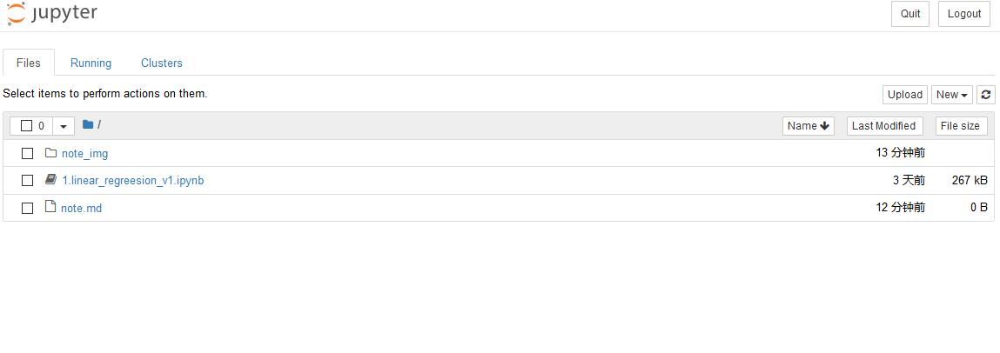

在Running中，可以看到正在运行的notebook，我们可以选择结束正在运行的程序。


至于Clusters、Conda一般用不到，暂不做介绍，后续补充。

## 四、编辑界面(Notebook Editor)

一个notebook的编辑界面主要由四部分组成：名称、菜单栏、工具条以及单元(Cell)，如下图所示：

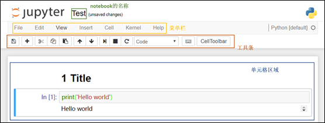

### 4.1 名称

在这里，我们可以修改notebook的名字，直接点击当前名称，弹出对话框进行修改：


### 4.2菜单栏

菜单栏中有File、Edit、View、Insert、Cell、Kernel、Help等功能，下面逐一介绍。

#### 4.2.1 File

File中的按钮选项如下图所示：

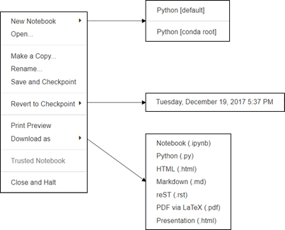

具体功能如下表：

|选项|功能|
|:--:|:--:|
|New Notebook|新建一个notebook|
|Open…|在新的页面中打开主面板|
|Make a Copy…|复制当前notebook生成一个新的notebook|
|Rename…|notebook重命名|
|Save and Checkpoint|将当前notebook状态存为一个Checkpoint|
|Revert to Checkpoint|恢复到此前存过的Checkpoint|
|Print Preview|打印预览|
|Download as|下载notebook存为某种类型的文件|
|Close and Halt|停止运行并退出该notebook|

#### 4.2.2 Edit

Edit中的按钮选项如下图所示：

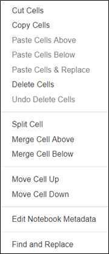

选项|功能
:--:|:--:
Cut Cells|剪切单元
Copy Cells|复制单元
Paste Cells Above|在当前单元上方粘贴上复制的单元
Paste Cells Below|在当前单元下方粘贴上复制的单元
Paste Cells & Replace|替换当前的单元为复制的单元
Delete Cells|删除单元
Undo Delete Cells|撤回删除操作
Split Cell|从鼠标位置处拆分当前单元为两个单元
Merge Cell Above|当前单元和上方单元合并
Merge Cell Below|当前单元和下方单元合并
Move Cell Up|将当前单元上移一层
Move Cell Down|将当前单元下移一层
Edit Notebook Metadata|编辑notebook的元数据
Find and Replace|查找替换，支持多种替换方式：区分大小写、使用JavaScript正则表达式、在选中单元或全部单元中替换

#### 4.2.3 View

View中的按钮选项如下图所示：

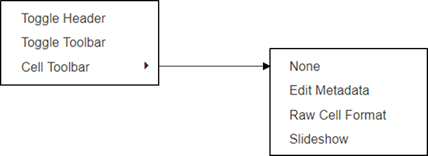

具体功能如下表：

选项|功能
:--:|:--:
Toggle Header|隐藏/显示Jupyter notebook的logo和名称
Toggle Toolbar|隐藏/显示Jupyter notebook的工具条
Cell Toolbar|更改单元展示式样

View中的功能可以让用户更好的展示自己的notebook，但对编写代码、实现功能没有影响。

#### 4.2.4 Insert


功能：在当前单元上方/下方插入新的单元。

#### 4.2.5 Cell

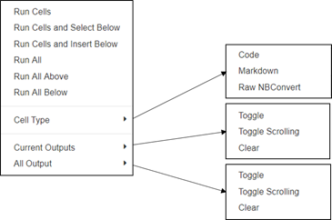

选项|功能
:--:|:--:
Run Cells|运行单元内代码
Run Cells and Select Below|运行单元内代码并将光标移动到下一单元
Run Cells and Insert Below|运行单元内代码并在下方新建一单元
Run All|运行所有单元内的代码
Run All Above|运行该单元（不含）上方所有单元内的代码
Run All Below|运行该单元（含）下方所有单元内的代码
Cell Type|选择单元内容的性质
Current Outputs|对当前单元的输出结果进行隐藏/显示/滚动/清除
All Output|对所有单元的输出结果进行隐藏/显示/滚动/清除

#### 4.2.6 Kernel

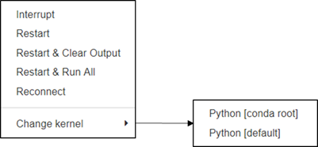

选项|功能
:--:|:--:
Interrupt|中断与内核连接（等同于ctrl-c）
Restart|重启内核
Restart & Clear Output|重启内核并清空现有输出结果
Restart & Run All|重启内核并重新运行notebook中的所有代码
Reconnect|重新连接到内核
Change kernel|切换内核

#### 4.2.7 Help

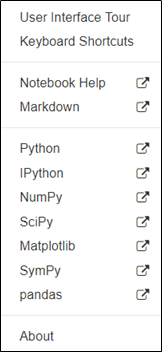

选项|功能
:--:|:--:
User Interface Tour|用户使用指南，非常棒的功能，带你全面了解notebook
Keyboard Shortcuts|快捷键大全
Notebook Help|notebook使用指南
Markdown|Markdown使用指南
Python…pandas|各类使用指南
About|关于Jupyter Notebook的一些信息


## 4.3 工具条

工具条中的功能基本上在菜单中都可以实现，这里是为了能更快捷的操作，将一些常用按钮放了出来。下图是对各按钮的解释。


### 4.4 单元(Cell)

在单元中我们可以编辑文字、编写代码、绘制图片等等。对于单元的详细内容放在第五节中介绍。

## 五、单元(Cell)

### 5.1两种模式与快捷键

对于Notebook中的单元，有两种模式：命令模式(Command Mode)与编辑模式(Edit Mode)，在不同模式下我们可以进行不同的操作。


如上图，在编辑模式(Edit Mode)下，右上角出现一只铅笔的图标，单元左侧边框线呈现出绿色，点Esc键或运行单元格(ctrl-enter)切换回命令模式。


在命令模式(Command Mode)下，铅笔图标消失，单元左侧边框线呈现蓝色，按Enter键或者双击cell变为编辑状态。

#### 5.1.1命令模式下的快捷键

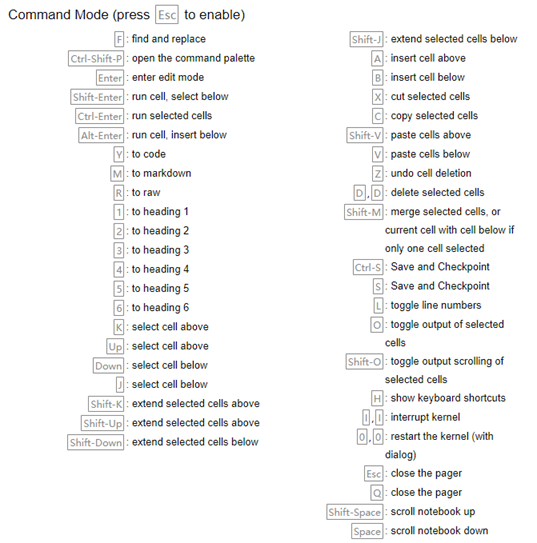

#### 5.1.2编辑模式下的快捷键

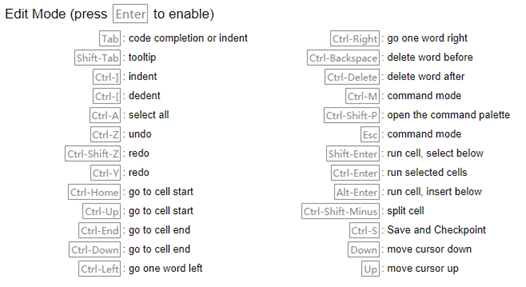

注意不要死记硬背，在使用过程中需要什么就去查，多用用就能记住了。

### 5.2 Cell的四种功能

Cell有四种功能：Code、Markdown、Raw NBConvert、Heading，这四种功能可以互相切换。Code用于写代码，Markdown用于文本编辑，Raw NBConvert中的文字或代码等都不会被运行，Heading是用于设置标题的，这个功能已经包含在Markdown中了。四种功能的切换可以使用快捷键或者工具条。

Code用于写代码，三类提示符及含义如下：

提示符|含义
:--:|:--:
In[ ]|程序未运行
In[num]|程序运行后
In[*]|程序正在运行

Markdown用于编辑文本，给出常用的Markdown用法：

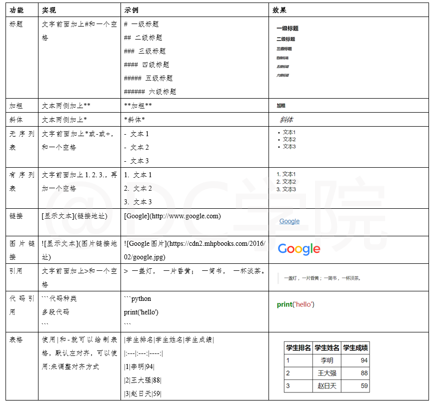

其他非常用的用法需要时可以再查阅。

## 六、魔法函数

使用魔法函数可以简单的实现一些单纯python要很麻烦才能实现的功能。

%：行魔法函数，只对本行代码生效。

%%：Cell魔法函数，在整个Cell中生效，必须放于Cell首行。

%lsmagic：列出所有的魔法函数

%magic查看各个魔法函数的说明

?后面加上魔法函数名称，可以查看该函数的说明

一些常用魔法函数的示例：

魔法函数|作用
:--:|:--:
%%writefile|调用外部python脚本
%run|调用外部python脚本
%timeit|测试单行语句的执行时间
%%timeit|测试整个单元中代码的执行时间
% matplotlib inline|显示 matplotlib 包生成的图形
%%writefile|写入文件
%pdb|调试程序
%pwd|查看当前工作目录
%ls|查看目录文件列表
%reset|清除全部变量
%who|查看所有全局变量的名称，若给定类型参数，只返回该类型的变量列表
%whos|显示所有的全局变量名称、类型、值/信息
%xmode Plain|设置为当异常发生时只展示简单的异常信息
%xmode Verbose|设置为当异常发生时展示详细的异常信息
%debug|bug调试，输入quit退出调试
%env|列出全部环境变量

注意这些命令是在Python kernel中适用的，其他 kernel 不一定适用

## 七、其他

（1）按tab键查看提示信息或者补全命令


2）在一个库、方法或变量前加上 ?，就可以获得它的一个快速语法说明


（3）使用分号可以阻止该行函数的结果输出

